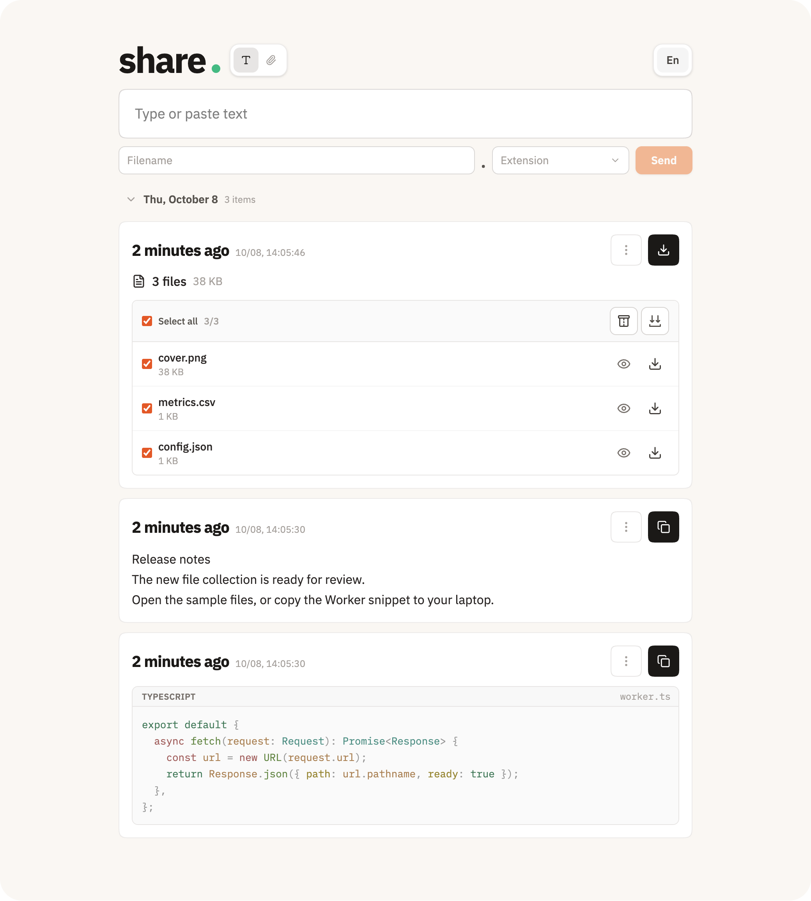
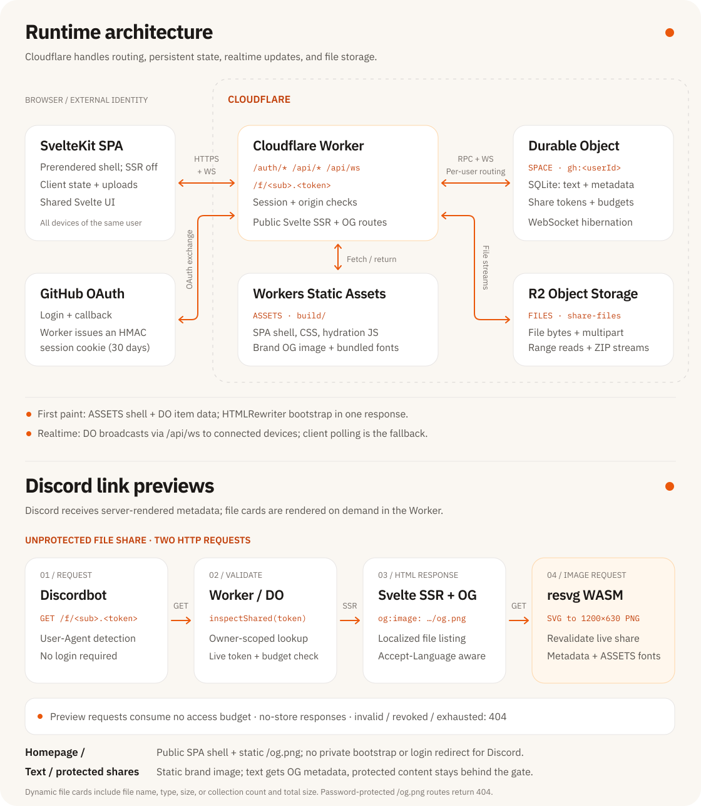

<div align="center">

<h1></h1>

A self-hosted text and file relay for your devices, built on Cloudflare.

[](https://github.com/fang2hou/share/actions/workflows/ci.yml)
[](./LICENSE)

</div>

Run share locally or deploy your own instance to Cloudflare. Sign in with the same GitHub account on your devices to sync text and files in real time, ready to copy or download. Public share links give others access to selected items without an account.



## 🚀 Usage / Quick Start

To work on the repository with an AI coding agent, paste:

```text
Work in this repository. Read AGENTS.md at the repository root first and follow it.
```

Items remain until you delete them. Files can be up to 256 MiB each. Share links let you give others access to an item without an account, with an optional password and access limit.

To run locally, install [mise](https://mise.jdx.dev/) on macOS or Linux, then clone the repository. `mise.toml` pins Node 24 and pnpm 12.

```bash
git clone https://github.com/fang2hou/share.git
cd share
mise install
pnpm install --frozen-lockfile
cp .dev.vars.example .dev.vars
```

Start the Worker and frontend in separate terminals:

```bash
mise run dev:worker   # http://localhost:8787
mise run dev          # http://localhost:5173
```

Open [localhost:5173](http://localhost:5173) and select the GitHub sign-in button. The example credentials create a local development session, so an OAuth app is not required to try the app. Local data uses Cloudflare's Durable Object and R2 simulation.

<details>
<summary>Development and self-hosting</summary>

- For real GitHub sign-in, configure an OAuth app and a session secret as described in [DEVELOPMENT.md](./DEVELOPMENT.md#workflow).
- `pnpm preview` builds the app and serves it through the Worker on port 8787.
- Self-hosting requires Cloudflare Workers, SQLite Durable Objects, R2, a GitHub OAuth app, and Worker secrets. Replace the maintainer's domain and CI configuration with your own settings. See [deployment setup](./DEVELOPMENT.md#deploying).
- `mise run check` runs lint, formatting checks, and type checks. `mise run test` also runs the integration tests.

</details>

## 💡 Concepts

A single Cloudflare Worker routes requests to a per-user SQLite Durable Object and R2. Workers Static Assets serves the SvelteKit shell; the Worker injects initial data and renders public share pages from the shared Svelte UI.

Discord previews use server-rendered Open Graph metadata. Unprotected file shares generate their PNG cards on demand with resvg WASM; text and password-protected shares use the static brand image.



See [ARCHITECTURE.md](./ARCHITECTURE.md) for isolation, access budgets, rendering, and file-transfer invariants.

## 📚 Learn More

| Goal                  | Read                                 |
| --------------------- | ------------------------------------ |
| Understand the system | [ARCHITECTURE.md](./ARCHITECTURE.md) |
| Develop or self-host  | [DEVELOPMENT.md](./DEVELOPMENT.md)   |
| Contribute a change   | [CONTRIBUTING.md](./CONTRIBUTING.md) |
| Give it to an agent   | [AGENTS.md](./AGENTS.md)             |

## 📄 License

Released under the [MIT License](./LICENSE).
